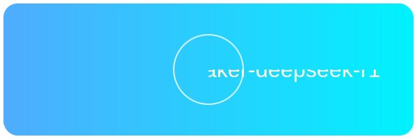

<div align="center">
  
  
# 🚀 DeepSeek-R1 on SageMaker via Terraform

</div>

<p align="center">
    
    
</p>

このリポジトリは、Amazon SageMaker JumpStart の DeepSeek-R1 モデルを Terraform を用いてエンドポイントとしてデプロイし、Python スクリプトから推論呼び出しを行うサンプルです。

>[!WARNING] 本サンプルは、現在検証中です

## 🔧 前提条件

- AWS CLI の設定済み（適切なクレデンシャルが利用可能であること）
- Terraform がインストール済み
- Python 3.8以上がインストール済み
- SageMaker 用の ml.p5e.48xlarge インスタンス利用可能なクォータ（必要に応じてクォータ増加申請してください）

## 📦 ディレクトリ構成

```
.
├── example/
│   ├── deepseek/         # DeepSeek基本デプロイメント例
│   │   ├── README.md
│   │   ├── variables.tf
│   │   ├── deploy_with_builder.py
│   │   └── main.tf
│   └── beta/             # ベータ版デプロイメント設定
│       ├── provider.tf
│       ├── variables.tf
│       ├── outputs.tf
│       ├── terraform.tfvars
│       ├── iam.tf
│       └── main.tf
├── script/               # デプロイ・実行スクリプト
│   ├── deploy_jumpstart_image.py
│   ├── invoke.py
│   └── deploy_deepseek.py
└── README.md
```

## 🚀 クイックスタート

### 1. JumpStartイメージURIの取得

```bash
cd script
python deploy_jumpstart_image.py --model-id deepseek-llm-r1 --region ap-northeast-1
```

### 2. Terraformによるデプロイ

```bash
cd example/deepseek
terraform init
terraform plan
terraform apply
```

### 3. エンドポイントの呼び出し

```bash
cd ../../script
python invoke.py
```

## 📚 デプロイメントオプション

### 基本デプロイメント（example/deepseek）

- ModelBuilderを使用した柔軟なデプロイメント
- カスタマイズ可能なパラメータ設定
- 詳細は `example/deepseek/README.md` を参照

### ベータ版デプロイメント（example/beta）

- より詳細なIAM設定
- カスタマイズ可能なインスタンスタイプ
- 環境変数による設定

## 🛠️ スクリプト説明

### deploy_jumpstart_image.py
- JumpStartモデルイメージURIの取得
- terraform.tfvarsの自動更新

### deploy_deepseek.py
- SageMaker ModelBuilderを使用したデプロイ
- エンドポイント作成の自動化

### invoke.py
- デプロイされたエンドポイントへの推論リクエスト
- サンプルプロンプトの実行

## ⚠️ 注意事項

- **コスト管理**: SageMakerエンドポイントは稼働中は課金が発生します
- **クォータ制限**: 大規模なインスタンスタイプを使用する場合は、AWSのクォータ制限を確認してください
- **セキュリティ**: 本番環境では必要最小限の権限に絞ることを推奨します

## 🧹 クリーンアップ

使用後は以下のコマンドでリソースを削除してください：

```bash
terraform destroy
```

## 💡 補足

- **Guardrails の利用**  
  AWS Bedrock Guardrails を適用する場合は、`invoke.py` にサンプルとしてレビュー済みのコードを追加してください。

- **IAMポリシーの調整**  
  本サンプルでは `AmazonSageMakerFullAccess` ポリシーを付与していますが、本番環境では必要最小限の権限に絞ることを推奨します。